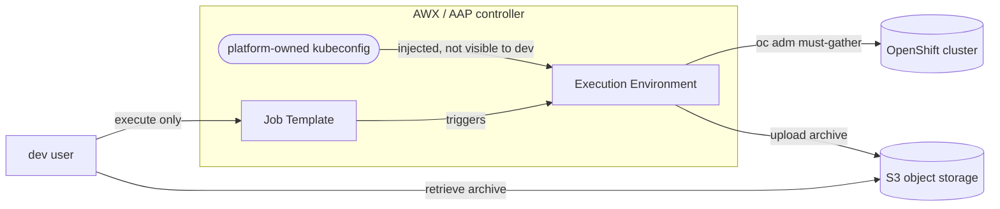

# Architecture And Security Reference

## Purpose

This reference explains the controlled brokered-execution model in AAP or AWX:

- Dev users can launch one predefined must-gather Job Template.
- Dev users cannot modify the privileged playbook logic.
- Dev users cannot view or use the privileged OpenShift credential directly.
- The job runs a fixed `oc adm must-gather` command.
- The job optionally runs a fixed must-gather-clean step.
- The job writes a predictable raw or cleaned archive, uploads it to
  S3-compatible object storage when enabled, and prints the handoff reference.
- AAP keeps the audit trail for who launched the job and when.

This is not delegated OpenShift RBAC. `oc adm must-gather` requires elevated
cluster access. AAP is intentionally acting as the broker for a privileged
operation.

## System Boundary



## Execution Model

The playbook runs on `localhost` inside the AAP execution environment. It
expects `oc` and a platform-owned kubeconfig injected by AAP.

The OpenShift identity used for all cluster actions is exactly the identity in
the attached kubeconfig credential. If that kubeconfig belongs to a human
cluster-admin user, the job is effectively running as that human user. That can
be acceptable for homelab or short-lived lab validation, but it is not the
recommended model for real use.

> **Warning**
>
> Do not use a personal cluster-admin kubeconfig for real pilots. Use a
> dedicated platform-owned service account or equivalent non-human identity.

Production-like use should attach a kubeconfig for a dedicated platform-owned
service account or equivalent non-human identity. That identity needs enough
privilege to run must-gather. In many clusters this is effectively
cluster-admin. The control boundary comes from the controller protecting that
credential and allowing dev users to execute only the fixed Job Template.

The implementation only accepts metadata:

| Variable | Required | Validation | Purpose |
|---|---:|---|---|
| `support_case_id` | yes | 3-64 chars, letters, numbers, `_`, `-` | Artifact naming and audit context |
| `reference_label` | no | 0-32 chars, letters, numbers, `_`, `-` | Optional artifact naming context |
| `ocp_must_gather_clean_enabled` | yes | `false` or `true` only, default `false` | Optional cleaning toggle |

No survey field changes the command, cluster, namespace, image, paths, cleaner
config, or command flags.

The fixed command is:

```bash
oc adm must-gather --dest-dir <controlled_work_dir>
```

The role then archives the collected directory with `tar`.

When `ocp_must_gather_clean_enabled` is true, the role runs:

```bash
must-gather-clean -c <platform_config> -i <raw_dir> -o <cleaned_dir> -r <report_dir>
```

The config is platform-owned and lives at:

```text
config/must-gather-clean/openshift_default.yaml
```

This config is based on the upstream OpenShift default example. It obfuscates
IPs, MACs, configured domain names, and Azure resource identifiers. It omits
Secrets, ConfigMaps, certificate signing requests, and MachineConfigs.
must-gather-clean is community-supported and is not a Red Hat-supported
product.

After the final archive exists and passes the local size check, the role can
upload it with `amazon.aws.s3_object` to platform-owned S3-compatible object
storage. The upload destination is not survey-controlled.

## Artifact Convention

Default output root:

```text
/runner/artifacts/ocp-must-gather
```

Archive name:

```text
must-gather_<raw|cleaned>_<cluster>_<support_case_id>[_<reference_label>]_<UTC timestamp>.tar.gz
```

Example:

```text
/runner/artifacts/ocp-must-gather/must-gather_cleaned_clustera_03912345_INC123_20260421T171530Z.tar.gz
```

The job prints the final local path and also publishes it through `set_stats`
as `must_gather_artifact_path`.

When cleaning is enabled, the final shared artifact is the cleaned output. The
raw must-gather directory is not the handoff artifact.

> **Caution**
>
> `must-gather-clean` writes `report.yaml`, which maps obfuscated values back
> to originals. Do not share this file. The playbook excludes it from the
> handoff archive.

For this MVP, `/runner/artifacts/ocp-must-gather` is the local staging
location before object storage upload. It must have enough space for the final
archive while the job is running. Users retrieve the archive from object
storage, not from controller runner storage. Do not expose
`ocp_must_gather_output_root` in the survey.

> **Important**
>
> The controller is the control and audit plane. It records who launched the job, when,
> and with what inputs. Object storage is the artifact handoff plane. Dev users
> retrieve the archive from object storage, not from controller job artifacts.

Object storage is the preferred download handoff plane. When enabled, object
keys use this pattern:

```text
<prefix>/<cluster>/<archive-name>
```

Example:

```text
must-gather/clustera/must-gather_raw_clustera_03912345_INC123_20260421T171530Z.tar.gz
```

The job emits both an `s3://<bucket>/<key>` reference and a URL-shaped
`<endpoint>/<bucket>/<key>` reference. The URL shape is a handoff reference,
not a presigned URL.

## Deployment References

This document explains the model and security boundary. It intentionally does
not duplicate the full controller setup.

- Use `docs/deployment-guide.md` to create the workflow in an existing
  AWX or AAP controller.
- Use `docs/aap-setup-runbook.md` for the detailed platform-admin setup
  sequence.
- Use `docs/aap-admin-implementation-checklist.md` as the rollout tracker.
- Use `docs/internal-validation-checklist.md` for internal platform validation
  after deployment.

## RBAC Intent

Platform team owns:

- Project
- Inventory
- Credential
- Execution Environment
- Job Template
- Source repository

Dev pilot team receives only:

- Execute role on `OpenShift Must-Gather - ClusterA`

Dev pilot team must not receive:

- Credential access
- Project update/admin access
- Inventory admin access
- Job Template admin access
- Organization admin access

Validate by logging in as a pilot dev user and confirming the user can launch
the template but cannot browse or edit the credential, project, inventory, or
template internals.

## Dev User Runbook

1. Open the controller.
2. Launch `OpenShift Must-Gather - ClusterA`.
3. Enter the Red Hat support case ID.
4. Optionally enter a short reference label.
5. Leave `Run must-gather-clean` set to `false` for standard runs, or select
   `true` only for a cleaning-enabled validation run.
6. Start the job.
7. Copy the printed object storage reference from the job output.
8. Retrieve the archive from the platform object storage handoff location.

Dev users cannot change the command, target cluster, credential, output path,
must-gather flags, must-gather-clean config, or cleaner flags.

## Failure Behavior

The job fails clearly if:

- `support_case_id` or `reference_label` does not match the allowed pattern.
- AAP did not inject `KUBECONFIG`.
- `oc` is missing.
- `must-gather-clean` is missing while cleaning is enabled.
- The credential cannot reach the cluster.
- The credential does not have broad cluster access.
- `oc adm must-gather` fails.
- must-gather-clean fails while cleaning is enabled.
- No files are produced.
- The archive is missing or too small.
- S3-compatible upload is enabled but endpoint, bucket, or credentials are
  missing.
- S3-compatible upload fails after archive creation.

On successful archive creation, the temporary work directory is removed by
default. On failure, the work directory may remain in `/tmp/ocp-must-gather-runs`
inside the execution environment for troubleshooting.

## Security Notes

- This is brokered execution, not OpenShift delegated RBAC.
- The OpenShift credential is privileged and must remain platform-owned.
- The job runs as the OpenShift identity represented by the attached
  kubeconfig.
- Do not use personal cluster-admin kubeconfigs outside homelab or temporary
  lab testing.
- Use a dedicated service account or equivalent non-human identity for real
  usage, and review or rotate that credential according to platform policy.
- The S3 object storage credential must remain platform-owned.
- The survey accepts metadata plus one constrained cleaning toggle only.
- No user input is used as a command, command flag, image, namespace, or path.
- User input can only turn must-gather-clean on or off. The cleaner config,
  report path, command, and flags stay platform-owned.
- The support case and label inputs are validated before they are used in file
  names.
- Do not add survey fields for arbitrary `oc` arguments.
- Do not add survey fields for must-gather-clean config, flags, or report path.
- Do not add survey fields for bucket, endpoint, object key, prefix, access
  key, secret key, or upload flags.
- Do not share must-gather-clean `report.yaml`.
- Do not embed tokens, kubeconfigs, private keys, kube contexts, or private
  endpoints in this repo.

## Deliberately Deferred

- Multi-cluster selection
- Approval workflows
- Vault-backed credentials
- Credential rotation automation
- Notifications
- Self-service download portal
- Per-team artifact storage isolation
- Presigned download URL generation
- Custom UI
- Arbitrary command execution
